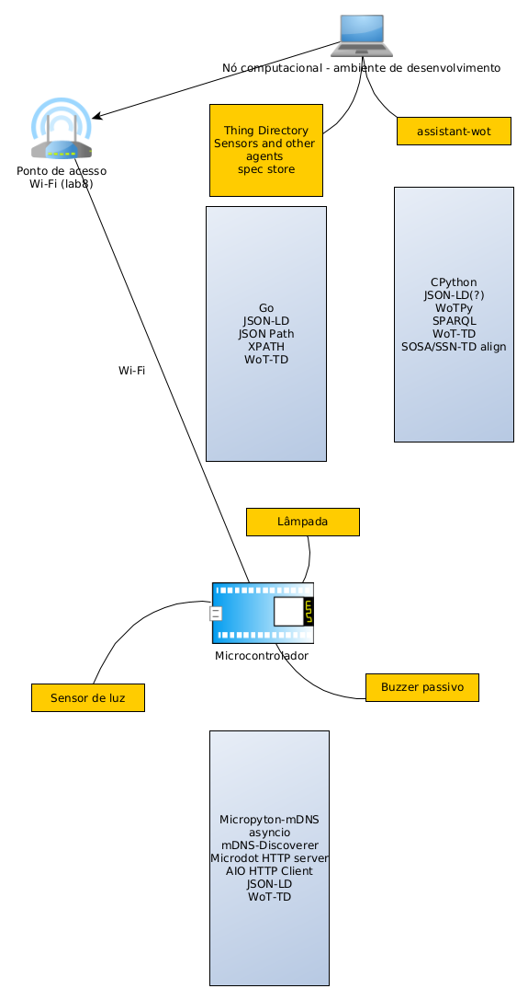

# Desenvolvimento de uma Proposta de Integração da Arquitetura de Web of Things com a Ontologia SOSA/SSN


## Conclusões até o momento

Partes da Integração da Arquitetura de Web of Things com a Ontologia SOSA/SSN existem, sejam como funcionamentos previstos, sejam como partes de definições e recomendações.

As partes que existem:

1. Thing Description (TD) não é, oficialmente, uma ontolologia pois é *draft* e não recomendação;
  - Mesmo assim, TD, serializado em JSON-LD pode ser traduzido para RDF (Turtle, XML,...) e tem namespace adequado;
2. Em TD, ontologias podem ser acrescentadas com o predicado `@context`;
3. A ontologia SAREF é usada em TD dessa forma;
4. Existe alinhamento, talvez completo, entre TD e SAREF;
5. Existe alinhamento (parcial) entre SOSA e TD;
6. Existe alinhamento (parcial) entre SOSA e SAREF;

## Comentários

  - SAREF é mais conveniente que SOSA pois o alinhamento com TD é mais fácil;
  - Não encontrei publicado um sistema como o que estamos tentando desenvolver.

## Descrição do sistema
  
A lista de entregáveis contempla A) um repositório de dados, B) um dispositivo IoT e C) um agente. No momento o repositório de dados é um *thing-directory* que recebe e armazena metadados e o agente (assistant-wot) é um *Consumer*, usado para interagir com um usuário humano através do navegador web.



As ferramentas e protocolos devem ser aderentes a recomendação W3C para Web of Things (https://www.w3.org/WoT/wg/). Trata-se de um esforço para padronizar e interoperar protocolos da Internet das Coisas através da agregação de soluções já adotadas. A documetação https://www.w3.org/WoT/documentation/ é extensa, merecendo destaque a arquitetura do sistema (Segundo a especificação (recomendação) https://www.w3.org/TR/wot-architecture/) e o protocolo de *descrição de Coisas* (https://www.w3.org/TR/wot-thing-description11).

Thing Description é serializado em JSON-LD (https://www.w3.org/TR/wot-thing-description11/#introduction-td)

O ciclo de vida de uso genérico, disponibilizado pela W3C é [6.4.2 System Lifecycle with Registration](https://www.w3.org/TR/wot-architecture/#system-lifecycle-no-directory) (há divergência entre o texto e o hiperlink)

### Elaborações que levaram à conclusão

Existe um esboço de recomendação W3C que se propõe a definir uma ontologia *Thing Description*: https://www.w3.org/2019/wot/td essa ontologia, associada às serializações das instâncias de dispositivos WoT (ié TD de um dispositivo) pode fazer parte de um grafo de conhecimento.

Existem conversores de JSON-LD para RDF como https://issemantic.net/rdf-converter . Usando esse conversor sobre o exemplo de TD de um dispositivo: https://www.w3.org/TR/wot-thing-description11/#thing-description-full-serialization obtém-se o seguinte grafo (em Turtle)

```
@prefix saref1: <https://w3id.org/saref#> .
@prefix td: <https://www.w3.org/2019/wot/td#> .
@prefix xsd: <http://www.w3.org/2001/XMLSchema#> .

<urn:uuid:300f4c4b-ca6b-484a-88cf-fd5224a9a61d> a saref1:LightSwitch ;
    td:definesSecurityScheme [ td:in "header" ;
            td:scheme "basic" ] ;
    td:hasActionAffordance [ a saref1:ToggleCommand ;
            td:hasForm [ td:href "https://mylamp.example.com/toggle" ] ] ;
    td:hasEventAffordance [ td:hasForm [ td:href "https://mylamp.example.com/oh" ] ;
            td:hasNotificationSchema [ td:type "string" ] ] ;
    td:hasPropertyAffordance [ a saref1:OnOffState ;
            td:hasForm [ td:href "https://mylamp.example.com/status" ] ;
            td:type "string" ] ;
    td:hasSecurityConfiguration "basic_sc"^^xsd:string ;
    td:title "MyLampThing"@en .

```

Analisando o grafo, nota-se que um dos prefixos é SAREF. Essa ontologia é definida pelo Instituto Europeu de Normas em Telecomunicações (ETSI) https://www.etsi.org/.

A ontologia SAREF, comparada a SOSA/SSN, define um vocabulário, em certo sentido, mais conveniente para descrever dispositivos conectados.

Segundo a IA do google no buscador com a string de busca "relation between saref and sosa":
  
```
SAREF (Smart Applications REFerence) and SOSA (Sensor, Observation, Sample, and Actuator) are related ontologies that address the semantic modeling of IoT data, but they have distinct focuses. SAREF is a broader ontology designed for general smart applications, while SOSA is more specialized in representing sensor observations and interactions. 
Here's a more detailed breakdown of their relationship:
SAREF's focus:
SAREF aims to provide a comprehensive semantic model for smart devices and applications, encompassing concepts like functions, services, states, and measurements. It's designed for general interoperability within smart applications. 
SOSA's focus:
SOSA, an extension of the Semantic Sensor Network (SSN) ontology, focuses on the interaction between sensors, observations, sampling, and actuators. It's specifically designed to model the data flow and relationships within sensor networks. 
Interrelation:
SAREF and SOSA are not mutually exclusive. SAREF can be used in conjunction with SOSA to provide a more comprehensive representation of smart systems. For example, SOSA can be used to model the sensor data, while SAREF can be used to model the overall smart application or device. 
SAREF's reuse of SOSA:
SAREF reuses and aligns with concepts from SOSA, which is also related to the DUL (Dublin University Ontology). This alignment facilitates the integration of data designed using SOSA with data designed using SAREF, according to W3C. 
SOSA-SAREF module:
The W3C SOSA-SAREF module specifically describes the alignment of SOSA to SAREF and other related ontologies. 
In essence, SAREF provides a general-purpose framework for smart applications, while SOSA specializes in modeling sensor observations and interactions. They are complementary ontologies that can be used together to create a more complete semantic representation of smart systems. 

```

Referências apontadas pelo buscador:
  
```
https://research.vu.nl/ws/portalfiles/portal/152825403/VanDerWeerdt2021_Chapter_ValidatingSAREFInASmartHomeEnvironment.pdf
https://saref.etsi.org/principles.html
https://w3c.github.io/sdw-sosa-ssn/ssn/#:~:text=into%20provenance%20systems.-,4.3.2%20SAREF,with%20data%20designed%20using%20SAREF.
```

O alinhamento entre SAREF e SOSA/SSN pode ser visto em https://w3c.github.io/sdw-sosa-ssn/ssn/#SAREF-alignment . Segundo essa referência, um grafo contendo o alinhamento está disponível.

A conveniencia de SAREF sobre SOSA fica clara no RDF onde o predicado `saref:ToggleCommand` é usado em conjunto com `td:hasForm` e `td:href` de maneira a codificar no grafo o URL que alterna o estado da lâmpada. SOSA não tem predicado similar a `saref:ToggleCommand`. Entretanto, `saref:ToggleCommand` foi **descontinuado** na versão 4.1.1 , conforme captura de tela abaixo:


Mais predicados foram descontinuados, por exemplo, `saref:LightSwitch` e, aparentemente, fazem falta pois alguns exemplos na documentação estão em branco.


Aparentemente não há substituto na nova versão pois o exemplo está em branco:
  


### Detalhamento dos entregáveis

A) Fork de thing-directory: https://github.com/FNakano/thing-directory parte do trabalho de Guilherme Lee foi colocar thing-directory para funcionar;

B) Dispositivo
  - primeira versão em https://github.com/FNakano/GL-esp32-TDD , sendo portada para MicroPyton
  - Hardware para versão em MicroPython: https://github.com/FNakano/CFA/tree/master/projetos/py-PlataformaTeste
  - Software para versão em MicroPython, ainda sem TD: https://github.com/FNakano/SWoT/tree/main/Dispositivo

C) Agente (assistant-wot): https://github.com/FNakano/Adryelli-IC/tree/main/assistant-wot
